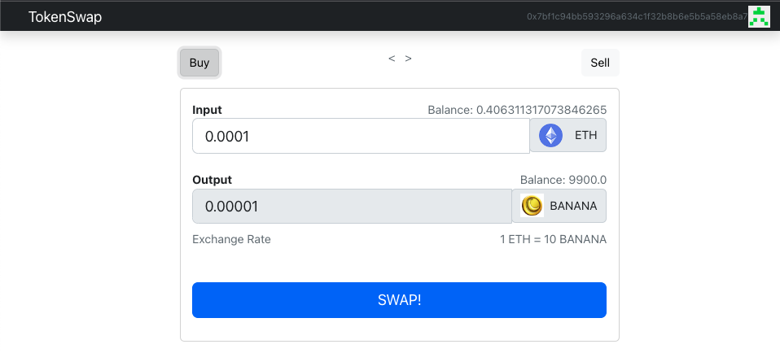
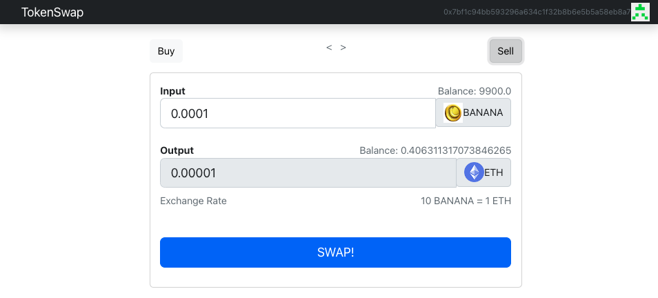

# token_swap_dapp

[DETAILS](#details)   
[HOW TO RUN](#how-to-run)   

### **DETAILS**

- This is a Token Swap Dapp that allows for exchange between ETH and BananaToken, with a fixed price and immediate settlement (upon availability of funds)

- Smart contracts written in Solidity and Hardhat, unit tests written with Chai and Mocha

- Contracts are deployed on the Goerli test network on the Ethereum blockchain
    - BananaToken.sol - https://goerli.etherscan.io/address/0xfcafA643eF33b1C388bA3aACe31D2899943A311B
    - TokenSwap.sol - https://goerli.etherscan.io/address/0x4E6b04801c5890D8045B0D585f8AD6FD2a33C503

- Front-end website made with ReactJS (Hooks, Components) and react-bootstrap. Currently deployed with Vercel:
  - https://token-swap-dapp-jnm0vditk-poletto123.vercel.app/

### **HOW TO RUN**

1. Clone the project to your computer, install NodeJS, and then type

```
npm start
```

2. Install Metamask wallet to your browser, connect it to Goerli, then add fake ETH to it with a faucet. Examples:

- https://goerlifaucet.com/
- https://goerli-faucet.pk910.de/

3. Buy BananaTokens or sell them



